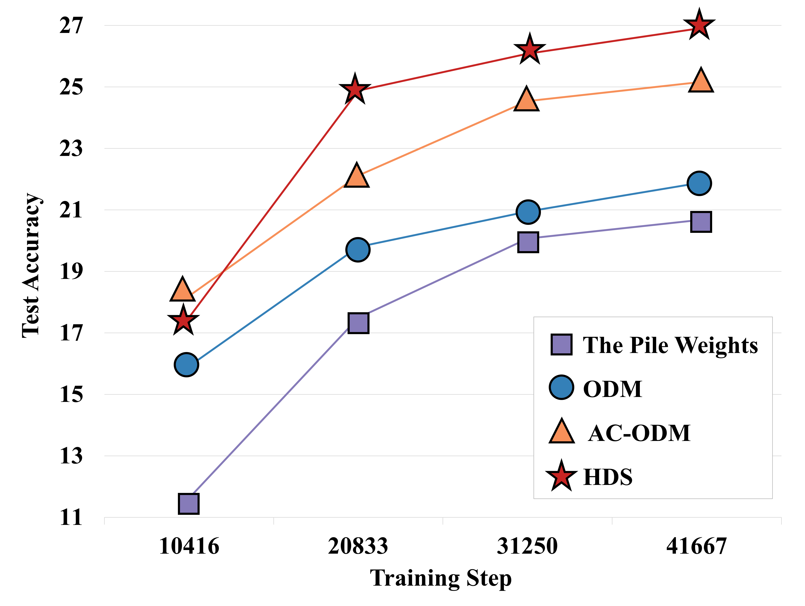

# Holistic Data Scheduler for LLM Pre-training via Multi-Objective Reinforcement Learning

This repository is the official implementation of **Holistic Data Scheduler for LLM Pre-training via Multi-Objective Reinforcement Learning**. 

The zenodo DOI：[](https://doi.org/10.5281/zenodo.18123749)


## Requirements

### Recommended Hardware

We recommend using a single server equipped with 8× NVIDIA H800 80GB or 8× NVIDIA H100 80GB GPUs. Additionally, at least **512GB of RAM** and **2TB of storage** are recommended.

### Codebase and Compatibility

Our codebase is based on the Pythia version of [GPT-NEOX](https://github.com/EleutherAI/gpt-neox), which is an older codebase. We have modified several functions to make it compatible with **PyTorch 2.x** and NVIDIA's **Hopper architecture**. If you are already familiar with [GPT-NEOX](https://github.com/EleutherAI/gpt-neox), you should be able to quickly get started with this repository.

### Environment Setup (Recommended: Anaconda)

We suggest using Anaconda to configure your environment.

First, create and activate a new conda environment:

```bash
conda create -n neox python=3.9
conda activate neox
```

Install PyTorch and CUDA dependencies:

```bash
conda install pytorch==2.1.2 torchvision==0.16.2 torchaudio==2.1.2 pytorch-cuda=12.1 -c pytorch -c nvidia
```

Then, install FlashAttention:

```bash
wget https://github.com/Dao-AILab/flash-attention/releases/download/v2.5.6/flash_attn-2.5.6+cu122torch2.1cxx11abiFALSE-cp39-cp39-linux_x86_64.whl
pip install flash_attn-2.5.6+cu122torch2.1cxx11abiFALSE-cp39-cp39-linux_x86_64.whl
```

Install the remaining Python dependencies:

```bash
pip install -r requirements.txt
```

Finally, compile and install the custom CUDA kernels:

```bash
python ./megatron/fused_kernels/setup.py install
```


## Preprocessing Data
Our project and code rely on [The Pile](https://github.com/EleutherAI/the-pile) dataset, which you can download from the official GitHub repository.

Let's start preprocessing the data using the 30 training set `.jsonl` files (`00.jsonl` to `29.jsonl`) and one test set `.jsonl` file you have downloaded.

### Step 1: Divide Domains of the Training Set

Ensure all `00.jsonl` to `29.jsonl` files are located in the `INPUT_DIR` directory. Then run the following command:

```bash
# Divide domains of the training set
python divide_pile_single.py --input_dir INPUT_DIR --output_dir OUTPUT_DIR
```

### Step 2: Divide Domains of the Test Set

To process the test set, run the following command:

```bash
# Divide domains of the test set
python divide_pile_test.py --input_file TEST_JSONL_FILE --output_dir OUTPUT_DIR
```

### Step 3: Preprocess All Domains

Finally, preprocess all the domain-separated files using:

```bash
# Preprocess all domain-separated files
./preprocess_pile.sh OUTPUT_DIR PROCESSED_DIR
```

## Training

Before starting training, you need to set the `WANDB_API_KEY`. We recommend doing this by modifying line 30 in `deepy.py`:

```python
os.environ["WANDB_API_KEY"] = "YOUR_API_KEY_HERE"
```

### Experiment Configuration

Our experimental settings are primarily defined in the following files:

- The data configuration file: `./hds_config/data/pile.yml`
- Model hyperparameter files: located in `./hds_config/models/`
- SAC configuration files: such as `./hds_config/sac_X.yml`, where `X` can be `1B`, `410m`, etc.

Before training, make sure to update the `PROCESSED_DIR` field in `./hds_config/data/pile.yml` to match the `PROCESSED_DIR` path obtained in Step 3 of the Preprocessing Data section.

### Training HDS

#### Train HDS (1B)

Run the following command:

```bash
./hds_scripts/train_1B_hds.sh
```


## Evaluation

Since the main contribution of our work lies in the training process, this section provides guidance for evaluating downstream tasks after training is completed.

### MMLU Evaluation

We provide four scripts to reproduce our experimental results on the MMLU benchmark:

- **Evaluate 0-shot performance of HDS on MMLU:**

```bash
./hds_scripts/eval_1B_hds_0shot.sh
```

- **Evaluate 5-shot performance of HDS on MMLU:**

```bash
./hds_scripts/eval_1B_hds_5shot.sh
```


## Results

After training is complete, you can view our main experimental results under the `hds_1B` project on your Weights & Biases (wandb) account.

**The main results are shown below:**




**We also provide a comparison of the final perplexity (PPL) across different domains:**


### Evaluation of Downstream Tasks on [MMLU](https://github.com/EleutherAI/lm-evaluation-harness/tree/main/lm_eval/tasks/mmlu)

| Algorithm     | MMLU - 0-shot Accuracy | MMLU - 5-shot Accuracy |
|---------------|------------------------|-------------------------|
| **HDS**      | 0.26915              | 0.31064                 |

